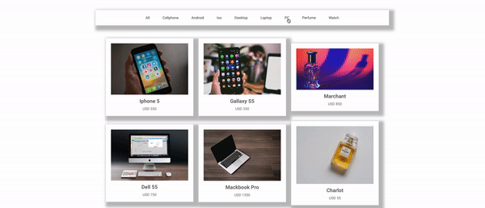

<h1 align="center">React Shop Filter</h1>

Projeto <strong>React Shop Filter </strong> desenvolvido com ReactJS

</img>

## Instalação

yarn ou npm install

## para rodar

## IOS:

yarn/npm start

</img>

Para maiores informações, veja o meu porfólio: https://portfolio.hellostudio.com.br#portfolio

